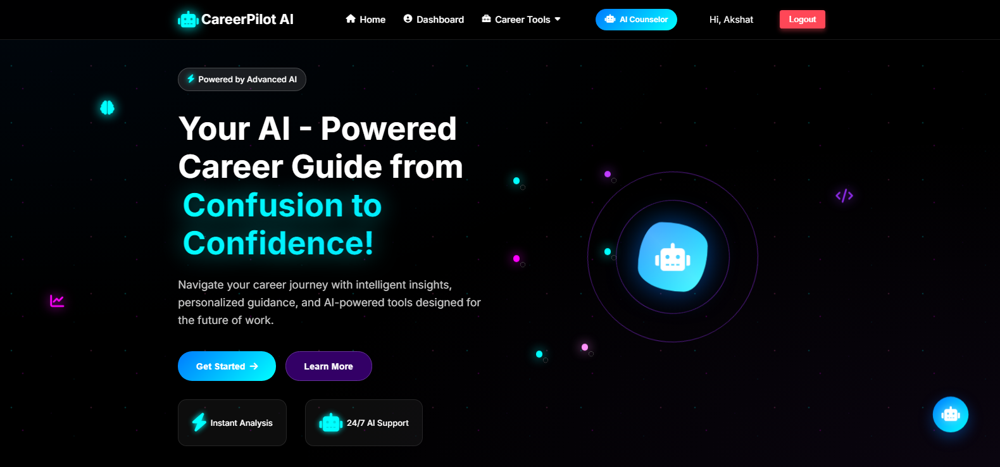
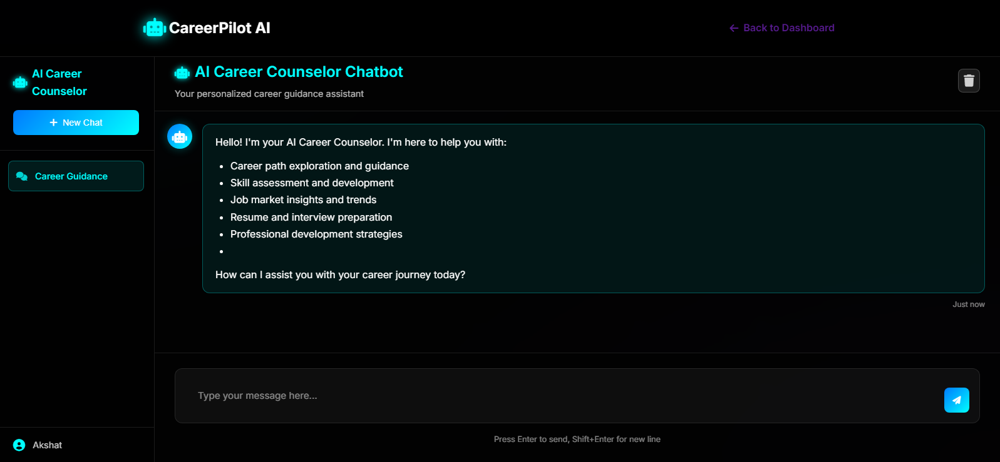
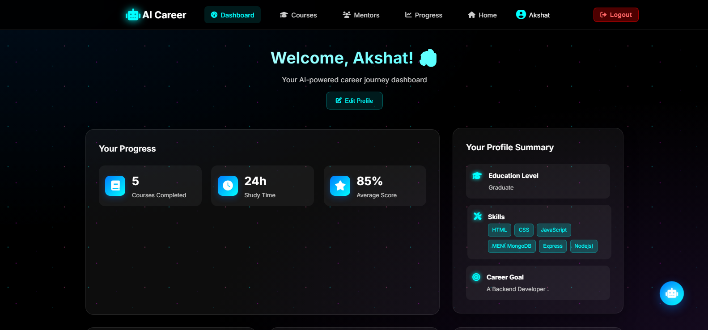
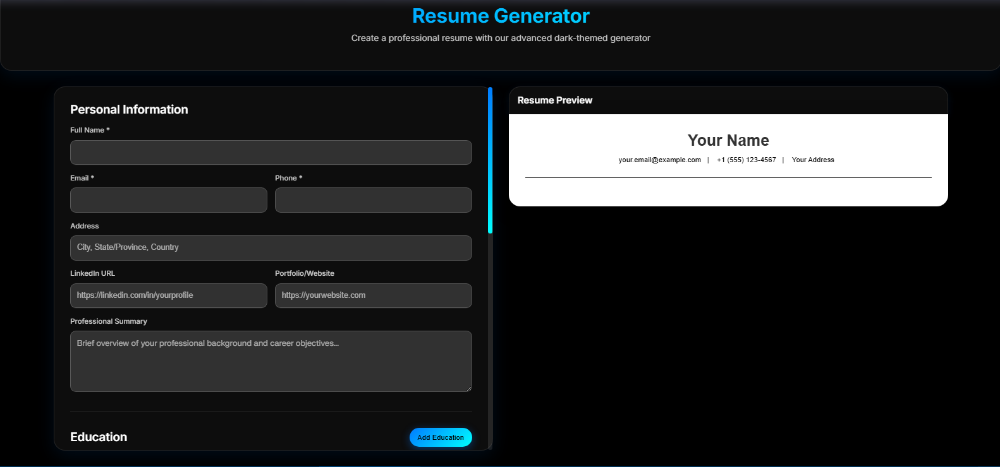

# 🚀 CareerPilot AI

An AI-powered career guidance platform designed to help students and professionals make informed career decisions through intelligent analysis and personalized recommendations.

## 📖 Overview

CareerPilot AI leverages Artificial Intelligence to provide personalized career counseling, resume analysis, skill gap detection, job recommendations, and interview preparation support. The platform helps users identify suitable career paths and improve their employability through data-driven insights.

## 📸 Screenshots

### 🏠 Home Page



### 🤖 AI Career Chat Assistant



### 👤 User Dashboard



### 📄 Resume Analysis




## ✨ Features

### 🎯 Career Guidance
- AI-powered career counseling
- Personalized career recommendations
- Career path exploration

### 📄 Resume Analysis
- Resume evaluation and feedback
- Strength and weakness identification
- Resume improvement suggestions

### 🧠 Skill Gap Detection
- Analyze existing skills
- Identify missing industry-relevant skills
- Personalized learning recommendations

### 💼 Job Recommendations
- AI-driven job matching
- Role suggestions based on profile and skills
- Career opportunity insights

### 🎤 Interview Preparation
- Interview guidance
- Common interview questions
- Preparation strategies and tips

### 🔐 User Management
- Secure user registration and login
- JWT-based authentication
- User profile management

## 🏗️ System Architecture

```text
User
 │
 ▼
Frontend (HTML, CSS, JavaScript)
 │
 ▼
Express.js Server
 │
 ├── Authentication Module
 │
 ├── AI Career Guidance Module
 │
 ├── Resume Analysis Module
 │
 ├── Job Recommendation Module
 │
 └── User Profile Management
 │
 ▼
MongoDB Database
```

## 🛠️ Tech Stack

### Frontend
- HTML5
- CSS3
- JavaScript

### Backend
- Node.js
- Express.js

### Database
- MongoDB

### Authentication
- JWT (JSON Web Token)

### AI Integration
- Generative AI APIs

### Deployment
- Render

## 📂 Project Structure

```text
CareerPilot-AI/
│
├── middleware/
├── models/
├── routes/
├── public/
│
├── server.js
├── package.json
├── package-lock.json
├── .gitignore
└── README.md
```

## ⚙️ Installation

### Clone the Repository

```bash
git clone https://github.com/akshatpremsingh/CareerPilot-AI.git
cd CareerPilot-AI
```

### Install Dependencies

```bash
npm install
```

### Configure Environment Variables

Create a `.env` file in the root directory:

```env
MONGODB_URI=your_mongodb_connection_string
JWT_SECRET=your_jwt_secret
AI_API_KEY=your_api_key
```

### Start the Application

```bash
npm start
```

or

```bash
node server.js
```

The application will run locally on:

```text
http://localhost:3000
```

## 🌐 Live Demo

https://careerpilot-ai-dlfig.onrender.com

## 🎯 Use Cases

- Students exploring career options
- Fresh graduates seeking job opportunities
- Professionals planning career transitions
- Individuals preparing for interviews
- Users looking to identify and bridge skill gaps

## 🔒 Security Features

- Password protection
- JWT authentication
- Protected routes
- Secure user session handling

## 🚧 Future Enhancements

- Career roadmap generation
- ATS resume scoring
- Mock interview simulation
- Learning resource recommendations
- Internship recommendations
- Career analytics dashboard
- Multi-language support

## 👥 Project Team

### Akshat Prem Singh

* Backend Development
* Database Design & Integration
* API Development
* Authentication System Implementation
* AI Integration
* Frontend–Backend Integration
* Application Deployment
* Version Control & Repository Management

### Aashi Piproliya

* Frontend Development
* User Interface Design
* User Experience Implementation
* Frontend Architecture & Development

### Avni Gupta

* Project Documentation
* Thesis Paper Preparation
* Project Report Preparation
* Presentation (PPT) Development 
* Project Coordination and Support

## 👨‍🎓 Academic Project

CareerPilot AI was developed as a collaborative B.Tech Computer Science major project. Team members contributed across backend development, frontend development, AI integration, system integration, documentation, thesis preparation, deployment, and project presentation.


## 📜 License

This project is developed for educational and academic purposes as part of a B.Tech Computer Science major project.

---

⭐ If you find this project useful, consider giving it a star.
